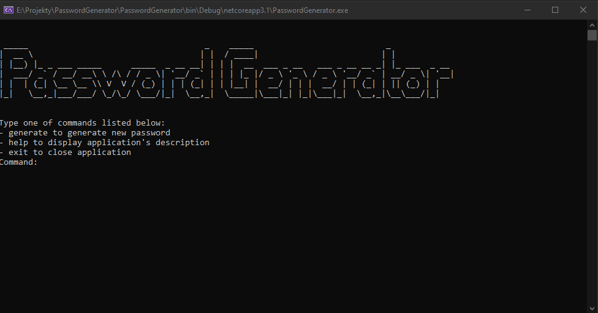

# Password Generator
> Simple console password generator build with .NET Core 3.1

## General info
Console password generator which is able to generate three types of passwords:
* simple password (lowercase letters and numbers)
* medium password (lowercase and uppercase letters with numbers) 
*strong password (lowercase and uppercase letters with numbers and special charcters).

The usage of this password generator is based on typing specified commands in console like 'generate' or 'help'. Password generation process relys on factory pattern so it's project is easy to expand by the new types of passwords. Project was created to learn dependency injection with Autofac and unit tests with NUnit.

## Screenshots

## Technologies
* .NET Core 3.1
* Autofac 5.1.4
* NUnit 3.12.0
* NUnit3TestAdapter 3.16.1

## Status
Project is: _finished_.
